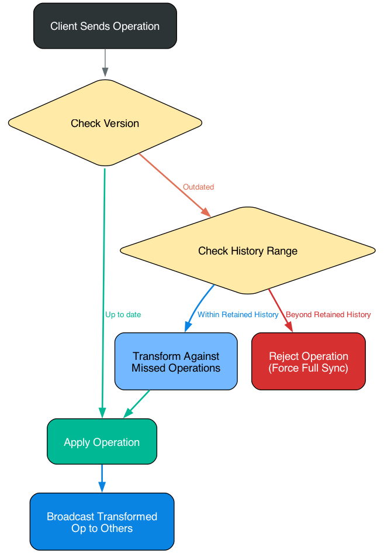
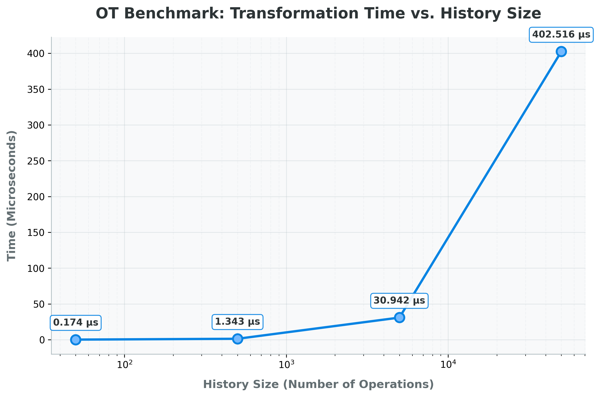

# Real-Time Collaborative Editor Engine

**A high-performance, real-time collaborative text editing backend built to handle strong concurrency, massive simultaneous edits, and unstable client connections.**

Instead of relying on off-the-shelf solutions like Yjs or existing CRDT libraries, this project implements a custom Operational Transformation (OT) engine from scratch. This ensures complete control over document state, memory management, and conflict resolution, proving that a bespoke engine can be robust, scalable, and highly efficient.

## Tech Stack

• **Framework:** Spring Boot

• **Language:** Java

• **Database:** PostgreSQL

• **Security:** Spring Security, JSON Web Tokens (JWT)

• **Utilities:** MapStruct (DTO mapping), Lombok (Boilerplate reduction)

• **Testing/Benchmarking:** JMH (Java Microbenchmark Harness)

## Core Features

• **Custom Operational Transformation (OT):** Resolves edit conflicts seamlessly when multiple users type in the same millisecond or when clients suffer from poor network latency.

• **Smart State Synchronization:** Clients and servers track document states using incrementing version numbers. Only operations are sent over the wire, keeping payloads tiny.

• **Intelligent Memory Management:** The server periodically truncates operation history to prevent memory leaks.

• **Lazy Database Flushing:** Document state is flushed to PostgreSQL only after a period of inactivity, drastically reducing database load and I/O bottlenecking.

• **Automatic Snapshots:** Document states are snapshotted automatically over time, allowing users to revert changes to previous historical versions.

• **Granular Access Control:** A dual-layered security model combining user-specific explicit roles and document-level fallback policies.

## How the Sync Engine Works

Handling high-concurrency text editing requires strict rules on how data is shared and merged.

### Versioning & Transformation

Every document has a server version and a client version. When a client sends an operation, the server checks the client's version against its own. If the client is out of date, the server transforms the incoming operation against the history of operations the client missed, applies it, and broadcasts the transformed operation to all other connected clients via WebSockets.

### Memory vs. Sync Strategy

The biggest engineering challenge wasn't just writing the OT logic—it was debugging and preventing memory exhaustion. Storing infinite operation history per document is a guaranteed memory leak.

To solve this, history is intentionally reset. This creates a branching sync strategy:

1. **Slightly Outdated Clients**: If a client's version falls within the server's retained history range, the server sends the missing operations. The client's frontend reconstructs the state.

2. **Heavily Outdated Clients**: If a client falls too far behind (beyond the retained history), the server rejects the operation and forces a Full Sync.

_**Note: The server only ever transmits the entire document content in two scenarios: establishing an initial connection or forcing a full synchronization.**_

  

## Security & Access Control

Access is determined by evaluating both the User's explicitly granted permissions and the Document's general access policy.

• **Explicit Roles:** OWNER, MANAGE (can edit document settings and demote users), EDIT, READ, NONE.

• **Document Access Policies:** Fallback rules for users without explicit roles.

    • Example: PUBLIC_EDIT (Anyone connected can edit).

	• Example: RESTRICTED (Only users explicitly granted access can view/edit).

## Performance & Benchmarks

To ensure the custom OT logic could handle heavy loads without bottlenecking the WebSocket threads, the transformer was benchmarked using JMH.

The test measures the time it takes to transform a new operation against varying sizes of historical operations.

  

Results

| History Size | Mode | Cnt | Score(time) | Error    | Units |
|--------------|------|-----|-------------|----------|-------|
| 50           | avgt | 5   | 0.174       | ± 0.012  | us/op |
| 500          | avgt | 5   | 1.343       | ± 0.077  | us/op |
| 5000         | avgt | 5   | 30.942      | ± 12.177 | us/op |
| 5000         | avgt | 5   | 402.516     | ± 65.265 | us/op |

The OT engine is exceptionally fast. Even in an extreme scenario where an operation must be transformed against a backlog of 50,000 historical operations, the logic resolves in roughly ~0.4 milliseconds. In real-world scenarios, history sizes are truncated well before reaching these limits, ensuring sub-millisecond transformation times.

## Project Status & Production Readiness

This project was built primarily as a deep dive into **Operational Transformation** and complex state synchronization. While the JMH benchmarks demonstrate exceptional raw processing speed for the OT algorithm, the overall system has not yet been battle-tested in a live production environment.

Factors such as real-world network jitter, horizontal scaling across multiple JVM instances (e.g., using Redis Pub/Sub for cross-server WebSocket communication), and prolonged heavy-load scenarios over days or weeks are areas for future exploration and optimization.

### Dev. Notes

Building an Operational Transformation engine from the ground up instead of using established libraries provided massive confidence in understanding concurrency at a granular level. The hardest parts were not the algorithmic transformations themselves, but the surrounding infrastructure: debugging edge cases, managing JVM heap memory effectively, and gracefully recovering desynced clients.
